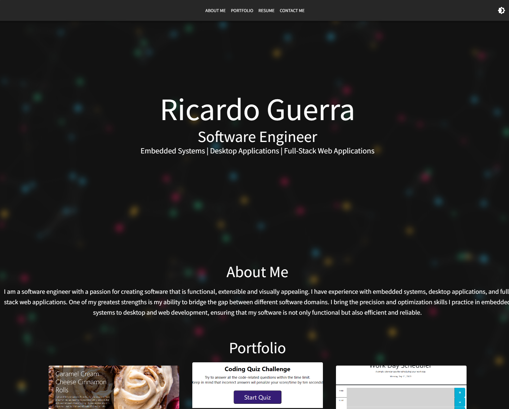

# React Portfolio
## Description
This project is a professional portfolio that showcases other projects and highlights skills. The entirety of this portfolio is built with React and Material UI components.
## Table of Contents
1. [Installation](#installation)
2. [Screenshot](#screenshot)
3. [License](#license)
6. [Questions](#questions)

## Installation
No installation is necessary. The source code can be viewed on Github and the deployed product can be viewed given the deployed link.

## Screenshot

## License
MIT

## Questions
Any questions regarding this utility can be directed to: 
    
- Author: ricguer (https://github.com/ricguer)
